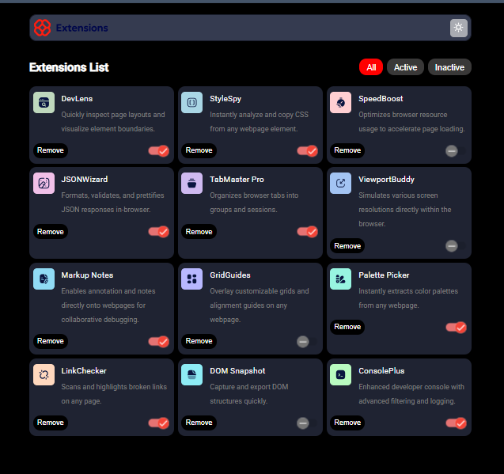
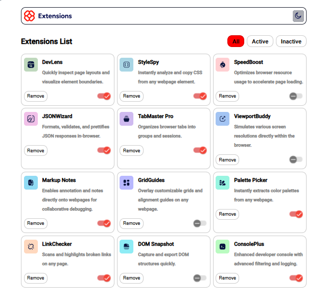

## Table of contents

- [Overview](#overview)
  - [The challenge](#the-challenge)
  - [Screenshot](#screenshot)
  - [Built with](#built-with)
  - [What I learned](#what-i-learned)
- [Author](#author)

## Overview
 
 This is a simple Extension Manager UI application that displays extensions as cards, each with a remove button and a toggle switch to activate or deactivate them.

### The challenge

Users should be able to:

- Toggle extensions between active and inactive states
- Filter active and inactive extensions
- Remove extensions from the list
- Select their color theme
- View the optimal layout for the interface depending on their device's screen size
- See hover and focus states for all interactive elements on the page

### Screenshot

### Links

- Solution URL: [Browser Extension Manager](https://www.frontendmentor.io/solutions/browser-extensions-manager-paOzCG5IJp)
- Live Site URL: [Browser Extension Manager](https://shanmukh-19.github.io/browser-extensions-manager/)

### Built with

- Angular and Angular Materials

### What I learned

This challenge helped me understand how Angular components function and how to implement communication between them.

## Author
- Frontend Mentor - [@Shanmukh-19](https://www.frontendmentor.io/profile/Shanmukh-19)

